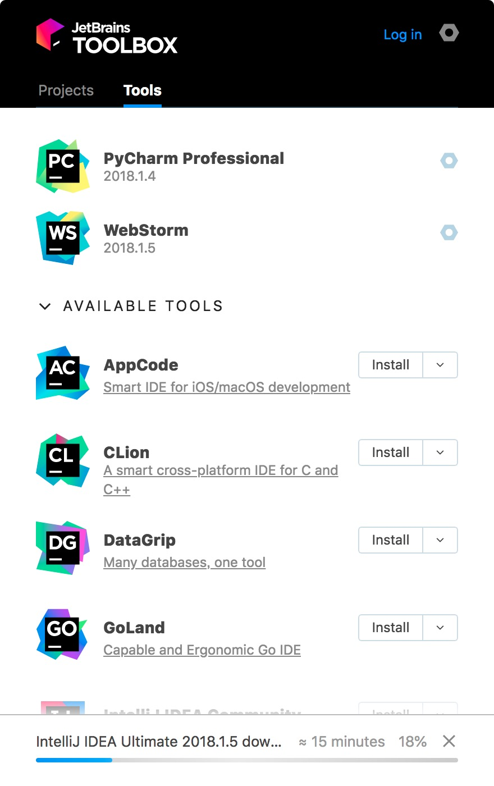
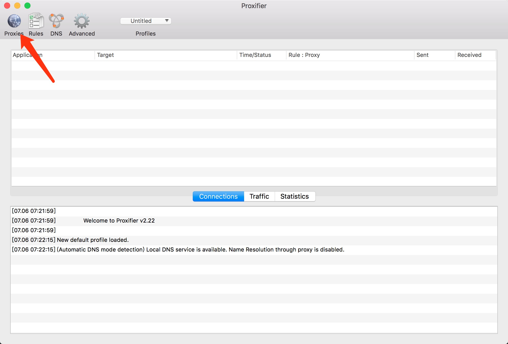
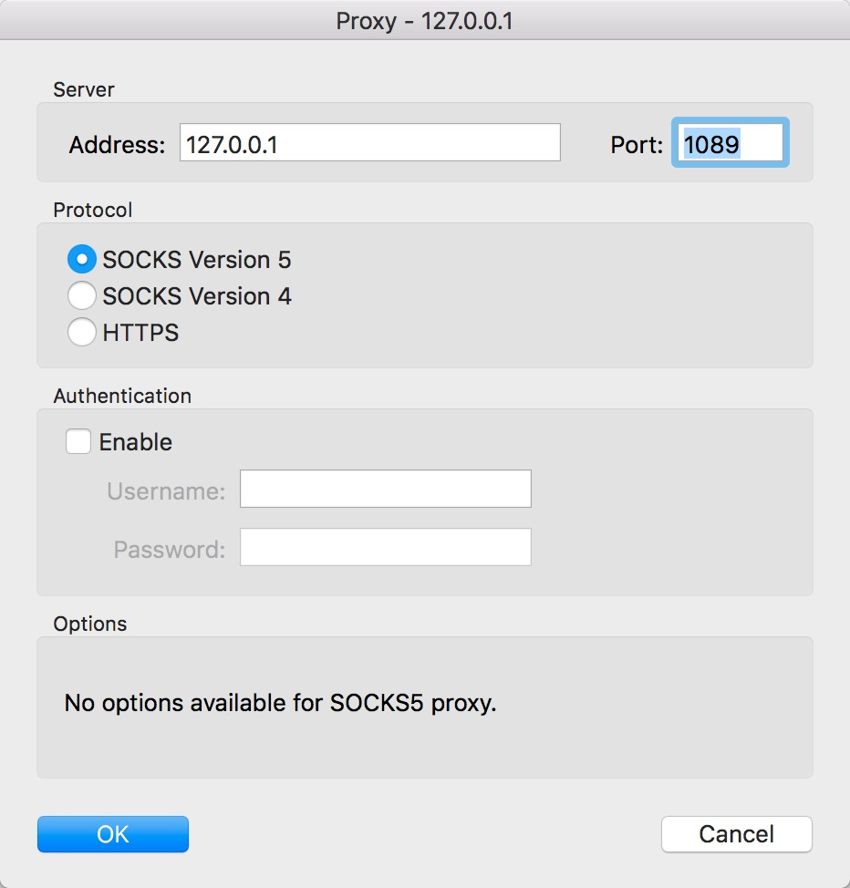
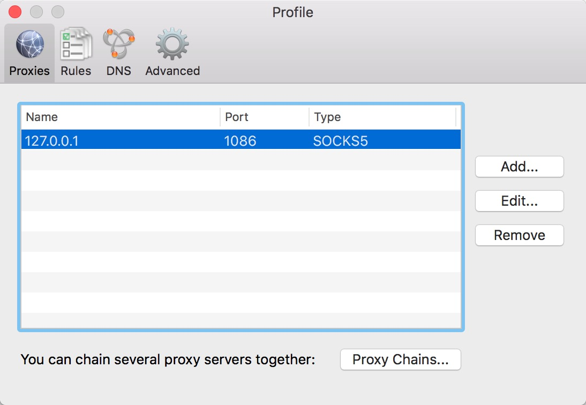
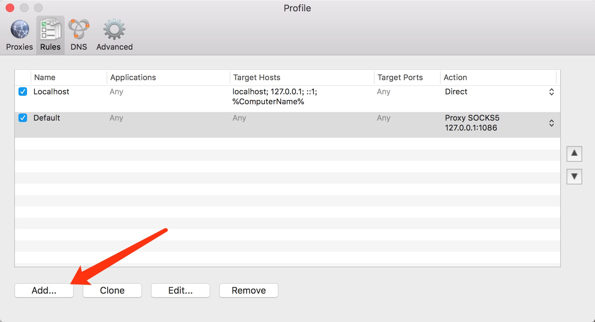
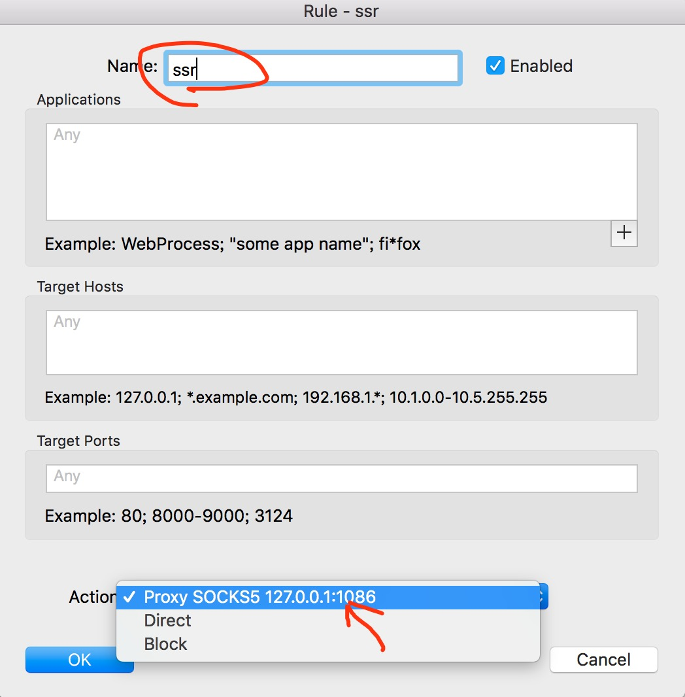
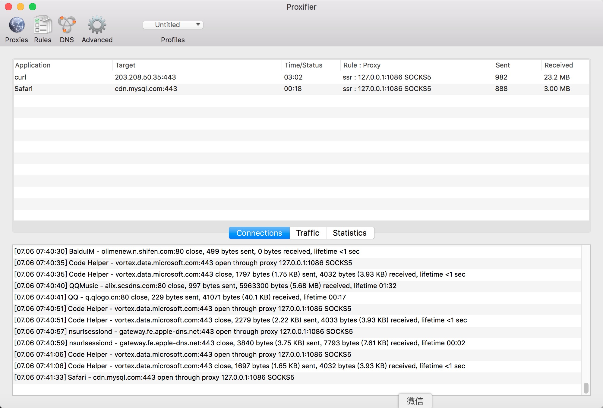
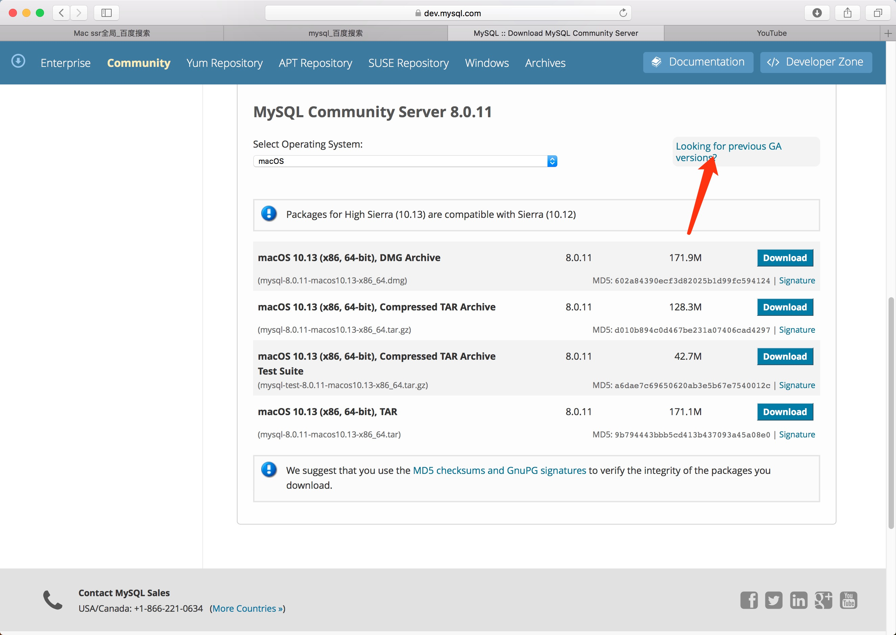
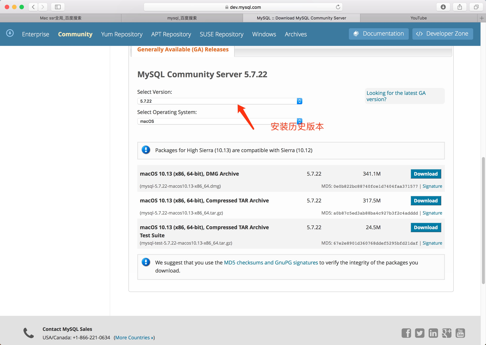

#  记录一次mac安装后的操作
##作者博客 https://www.lhrsite.com/
如有不足请多指教
## 忘对大家有帮助

介绍一下我是一个程序员全栈用的比较杂，所以涉及的比较多，工作机是macbookpro16顶配，台式机黑果&win10双系统

## 1. 安装homebrew
```shell
/usr/bin/ruby -e "$(curl -fsSL https://raw.githubusercontent.com/Homebrew/install/master/install)"
```
如果无法安装请对目标文件开权限
如果我没记错的话应该是 /usr/local/homebrew/
如果不对应该就是/usr/local/homebrew/library/homebrew/
如果记错的话希望大家反馈一下
```
sudo chmod -R 777 *
```
安装完成后更新一下
```
git -C "$(brew --repo homebrew/core)" fetch --unshallow
brew update && brew upgrade

```

## 2. 安装brew cask
这是一个基于homebrew的软件包管理的程序，非常好用
```
brew install caskroom/cask/brew-cask


==> Downloading https://github.com/xyb/homebrew-cask-completion/archive/v2.1.tar
==> Downloading from https://codeload.github.com/xyb/homebrew-cask-completion/ta
######################################################################## 100.0%
🍺  /usr/local/Cellar/brew-cask-completion/2.1_1: 5 files, 11.0KB, built in 3 seconds


haorans-iMac:~ lhr$ brew cask search chrome
==> Matches
chrome-devtools                          epichrome
chrome-remote-desktop-host               google-chrome
chromedriver                             mkchromecast
dmm-player-for-chrome
==> Remote Matches
homebrew/cask-versions/google-chrome-beta
homebrew/cask-versions/google-chrome-canary
homebrew/cask-versions/google-chrome-dev
homebrew/cask/chrome-devtools
homebrew/cask/chrome-remote-desktop-host
homebrew/cask/dmm-player-for-chrome
homebrew/cask/google-chrome

# 安装chrome浏览器
haorans-iMac:~ lhr$ brew cask install google-chrome
==> Satisfying dependencies
==> Downloading https://dl.google.com/chrome/mac/stable/GGRO/googlechrome.dmg
#                                                                          1.8%

```
## 3. 安装vscode[官网](https://code.visualstudio.com)
## 4. 安装百度输入法
为什么是百度输入法呢，搜狗输入法mac版的感觉不太好（个人认为）
## 5. 安装 qq，微信，xcode（不做介绍了）
## 6. 安装python
推荐使用pyenv安装可以进行版本控制
```
brew install pyenv
echo 'export PYENV_ROOT="$HOME/.pyenv"' >> ~/.bashrc
echo 'export PATH="$PYENV_ROOT/bin:$PATH"' >> ~/.bashrc
echo -e 'if command -v pyenv 1>/dev/null 2>&1; then\n  eval "$(pyenv init -)"\nfi' >> ~/.bashrc


pyenv install -l #列举版本
Available versions:
  2.1.3
  2.2.3
  2.3.7
  2.4
  2.4.1
  2.4.2
  2.4.3
  2.4.4
  2.4.5
  2.4.6
  2.5
  2.5.1
  2.5.2
  2.5.3
  2.5.4
  2.5.5
  2.5.6
  2.6.6
  2.6.7
  2.6.8
  2.6.9
  2.7-dev
  2.7
  2.7.1
  2.7.2
  2.7.3
  2.7.4
  2.7.5
  2.7.6
  2.7.7
  2.7.8
  2.7.9
  2.7.10
  2.7.11
  2.7.12
  2.7.13
  2.7.14
  2.7.15
  3.0.1
  3.1
  3.1.1
  3.1.2
  3.1.3
  3.1.4
  3.1.5
  3.2
  3.2.1
  3.2.2
  3.2.3
  3.2.4
  3.2.5
  3.2.6
  3.3.0
  3.3.1
  3.3.2
  3.3.3
  3.3.4
  3.3.5
  3.3.6
  3.3.7
  3.4.0
  3.4-dev
  3.4.1
  3.4.2
  3.4.3
  3.4.4
  3.4.5
  3.4.6
  3.4.7
  3.4.8
  3.5.0
  3.5-dev
  3.5.1
  3.5.2
  3.5.3
  3.5.4
  3.5.5
  3.6.0
  3.6-dev
  3.6.1
  3.6.2
  3.6.3
  3.6.4
  3.6.5
  3.6.6rc1
  3.7.0
  3.7-dev
  3.8-dev
  activepython-2.7.14
  activepython-3.5.4
  activepython-3.6.0
  anaconda-1.4.0
  anaconda-1.5.0
  anaconda-1.5.1
  anaconda-1.6.0
  anaconda-1.6.1
  anaconda-1.7.0
  anaconda-1.8.0
  anaconda-1.9.0
  anaconda-1.9.1
  anaconda-1.9.2
  anaconda-2.0.0
  anaconda-2.0.1
  anaconda-2.1.0
  anaconda-2.2.0
  anaconda-2.3.0
  anaconda-2.4.0
  anaconda-4.0.0
  anaconda2-2.4.0
  anaconda2-2.4.1
  anaconda2-2.5.0
  anaconda2-4.0.0
  anaconda2-4.1.0
  anaconda2-4.1.1
  anaconda2-4.2.0
  anaconda2-4.3.0
  anaconda2-4.3.1
  anaconda2-4.4.0
  anaconda2-5.0.0
  anaconda2-5.0.1
  anaconda2-5.1.0
  anaconda2-5.2.0
  anaconda3-2.0.0
  anaconda3-2.0.1
  anaconda3-2.1.0
  anaconda3-2.2.0
  anaconda3-2.3.0
  anaconda3-2.4.0
  anaconda3-2.4.1
  anaconda3-2.5.0
  anaconda3-4.0.0
  anaconda3-4.1.0
  anaconda3-4.1.1
  anaconda3-4.2.0
  anaconda3-4.3.0
  anaconda3-4.3.1
  anaconda3-4.4.0
  anaconda3-5.0.0
  anaconda3-5.0.1
  anaconda3-5.1.0
  anaconda3-5.2.0
  ironpython-dev
  ironpython-2.7.4
  ironpython-2.7.5
  ironpython-2.7.6.3
  ironpython-2.7.7
  jython-dev
  jython-2.5.0
  jython-2.5-dev
  jython-2.5.1
  jython-2.5.2
  jython-2.5.3
  jython-2.5.4-rc1
  jython-2.7.0
  jython-2.7.1
  micropython-dev
  micropython-1.9.3
  micropython-1.9.4
  miniconda-latest
  miniconda-2.2.2
  miniconda-3.0.0
  miniconda-3.0.4
  miniconda-3.0.5
  miniconda-3.3.0
  miniconda-3.4.2
  miniconda-3.7.0
  miniconda-3.8.3
  miniconda-3.9.1
  miniconda-3.10.1
  miniconda-3.16.0
  miniconda-3.18.3
  miniconda2-latest
  miniconda2-3.18.3
  miniconda2-3.19.0
  miniconda2-4.0.5
  miniconda2-4.1.11
  miniconda2-4.3.14
  miniconda2-4.3.21
  miniconda2-4.3.27
  miniconda2-4.3.30
  miniconda3-latest
  miniconda3-2.2.2
  miniconda3-3.0.0
  miniconda3-3.0.4
  miniconda3-3.0.5
  miniconda3-3.3.0
  miniconda3-3.4.2
  miniconda3-3.7.0
  miniconda3-3.8.3
  miniconda3-3.9.1
  miniconda3-3.10.1
  miniconda3-3.16.0
  miniconda3-3.18.3
  miniconda3-3.19.0
  miniconda3-4.0.5
  miniconda3-4.1.11
  miniconda3-4.2.12
  miniconda3-4.3.11
  miniconda3-4.3.14
  miniconda3-4.3.21
  miniconda3-4.3.27
  miniconda3-4.3.30
  pypy-c-jit-latest
  pypy-c-nojit-latest
  pypy-dev
  pypy-stm-2.3
  pypy-stm-2.5.1
  pypy-1.5-src
  pypy-1.5
  pypy-1.6
  pypy-1.7
  pypy-1.8
  pypy-1.9
  pypy-2.0-src
  pypy-2.0
  pypy-2.0.1-src
  pypy-2.0.1
  pypy-2.0.2-src
  pypy-2.0.2
  pypy-2.1-src
  pypy-2.1
  pypy-2.2-src
  pypy-2.2
  pypy-2.2.1-src
  pypy-2.2.1
  pypy-2.3-src
  pypy-2.3
  pypy-2.3.1-src
  pypy-2.3.1
  pypy-2.4.0-src
  pypy-2.4.0
  pypy-2.5.0-src
  pypy-2.5.0
  pypy-2.5.1-src
  pypy-2.5.1
  pypy-2.6.0-src
  pypy-2.6.0
  pypy-2.6.1-src
  pypy-2.6.1
  pypy-4.0.0-src
  pypy-4.0.0
  pypy-4.0.1-src
  pypy-4.0.1
  pypy-5.0.0-src
  pypy-5.0.0
  pypy-5.0.1-src
  pypy-5.0.1
  pypy-5.1-src
  pypy-5.1
  pypy-5.1.1-src
  pypy-5.1.1
  pypy-5.3-src
  pypy-5.3
  pypy-5.3.1-src
  pypy-5.3.1
  pypy-5.4-src
  pypy-5.4
  pypy-5.4.1-src
  pypy-5.4.1
  pypy-5.6.0-src
  pypy-5.6.0
  pypy-5.7.0-src
  pypy-5.7.0
  pypy-5.7.1-src
  pypy-5.7.1
  pypy2-5.3-src
  pypy2-5.3
  pypy2-5.3.1-src
  pypy2-5.3.1
  pypy2-5.4-src
  pypy2-5.4
  pypy2-5.4.1-src
  pypy2-5.4.1
  pypy2-5.6.0-src
  pypy2-5.6.0
  pypy2-5.7.0-src
  pypy2-5.7.0
  pypy2-5.7.1-src
  pypy2-5.7.1
  pypy2.7-5.8.0-src
  pypy2.7-5.8.0
  pypy2.7-5.9.0-src
  pypy2.7-5.9.0
  pypy2.7-5.10.0-src
  pypy2.7-5.10.0
  pypy2.7-6.0.0-src
  pypy2.7-6.0.0
  pypy3-dev
  pypy3-2.3.1-src
  pypy3-2.3.1
  pypy3-2.4.0-src
  pypy3-2.4.0
  pypy3.3-5.2-alpha1-src
  pypy3.3-5.2-alpha1
  pypy3.3-5.5-alpha-src
  pypy3.3-5.5-alpha
  pypy3.5-c-jit-latest
  pypy3.5-5.7-beta-src
  pypy3.5-5.7-beta
  pypy3.5-5.7.1-beta-src
  pypy3.5-5.7.1-beta
  pypy3.5-5.8.0-src
  pypy3.5-5.8.0
  pypy3.5-5.9.0-src
  pypy3.5-5.9.0
  pypy3.5-5.10.0-src
  pypy3.5-5.10.0
  pypy3.5-5.10.1-src
  pypy3.5-5.10.1
  pypy3.5-6.0.0-src
  pypy3.5-6.0.0
  pyston-0.5.1
  pyston-0.6.0
  pyston-0.6.1
  stackless-dev
  stackless-2.7-dev
  stackless-2.7.2
  stackless-2.7.3
  stackless-2.7.4
  stackless-2.7.5
  stackless-2.7.6
  stackless-2.7.7
  stackless-2.7.8
  stackless-2.7.9
  stackless-2.7.10
  stackless-2.7.11
  stackless-2.7.12
  stackless-2.7.14
  stackless-3.2.2
  stackless-3.2.5
  stackless-3.3.5
  stackless-3.3.7
  stackless-3.4-dev
  stackless-3.4.1
  stackless-3.4.2
  stackless-3.4.7
  stackless-3.5.4


pyenv install 3.7.0

python-build: use openssl from homebrew
python-build: use readline from homebrew
Downloading Python-3.7.0.tar.xz...
-> https://www.python.org/ftp/python/3.7.0/Python-3.7.0.tar.xz
Installing Python-3.7.0...
python-build: use readline from homebrew
Installed Python-3.7.0 to /Users/lhr/.pyenv/versions/3.7.0

# 查看当前安装python版本
haorans-iMac% pyenv versions   
* system (set by /Users/lhr/.pyenv/version)
  3.7.0


#设置3.7.0为默认版本
pyenv global 3.7.0  

```


## 7. 安装JetBrains Toolbox
JetBrains Toolbox是啥玩意？
JetBrains Toolbox是JetBrains家的工具箱，对JetBrains的开发工具进行管理
[下载地址-官方](http://www.jetbrains.com/toolbox/app/?fromMenu)
安装完长这样

可以在里面进行升级和删除安装操作还可以快捷打开项目

## 8.chrome
网不好的不推荐这样安装
```
brew cask install google-chrome

haorans-iMac:~ lhr$ brew cask install google-chrome
==> Satisfying dependencies
==> Downloading https://dl.google.com/chrome/mac/stable/GGRO/googlechrome.dmg
######################################################################## 100.0%
==> Verifying checksum for Cask google-chrome
==> Installing Cask google-chrome
==> Creating Caskroom at /usr/local/Caskroom
==> We'll set permissions properly so we won't need sudo in the future.
Password:
==> Moving App 'Google Chrome.app' to '/Applications/Google Chrome.app'.
🍺  google-chrome was successfully installed!
```
## 9. 安装oh-my-zsh
```
sudo xcodebuild -license accept
brew install oh-my-zsh
```

## 10. ssr
[download](./files/ShadowsocksX-NG-v1.4.3-R8.dmg)

## 11. proxifier 让socket走ssr

 参考[proxifier配合ss，实现真正的全局代理](https://www.echoteen.com/proxifier-newway.html)







## 12.安装node


```
brew install node 

==> Installing dependencies for node: icu4c
==> Installing node dependency: icu4c
==> Downloading https://homebrew.bintray.com/bottles/icu4c-62.1.high_sierra.bott
######################################################################## 100.0%
==> Pouring icu4c-62.1.high_sierra.bottle.tar.gz
==> Caveats
This formula is keg-only, which means it was not symlinked into /usr/local,
because macOS provides libicucore.dylib (but nothing else).

If you need to have this software first in your PATH run:
  echo 'export PATH="/usr/local/opt/icu4c/bin:$PATH"' >> ~/.bash_profile
  echo 'export PATH="/usr/local/opt/icu4c/sbin:$PATH"' >> ~/.bash_profile

For compilers to find this software you may need to set:
    LDFLAGS:  -L/usr/local/opt/icu4c/lib
    CPPFLAGS: -I/usr/local/opt/icu4c/include
For pkg-config to find this software you may need to set:
    PKG_CONFIG_PATH: /usr/local/opt/icu4c/lib/pkgconfig

==> Summary
🍺  /usr/local/Cellar/icu4c/62.1: 250 files, 67.3MB
==> Installing node
==> Downloading https://homebrew.bintray.com/bottles/node-10.6.0.high_sierra.bot
######################################################################## 100.0%
==> Pouring node-10.6.0.high_sierra.bottle.tar.gz
==> Caveats
Bash completion has been installed to:
  /usr/local/etc/bash_completion.d
==> Summary
🍺  /usr/local/Cellar/node/10.6.0: 6,793 files, 59.9MB
```


## 13.安装mysql
暂时不推荐安装5.7以上的之前作死装了一下很多工具都连不上库了
[社区版官网](https://dev.mysql.com/downloads/mysql/)




## 14. 推荐一个mac软件盗版的门户
[xclient.info](http://xclient.info/)


## 15.folx mac最好的下载工具
收费可去 [xclient.info](http://xclient.info/)下载


---
### 未完待续